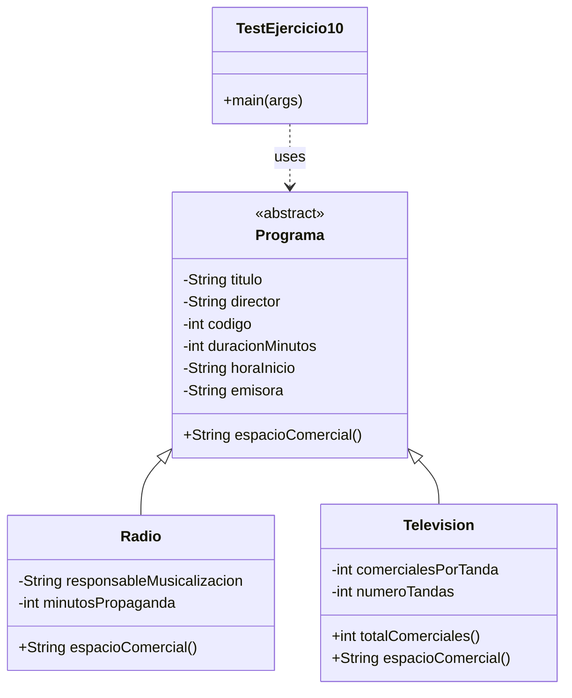

# Diagrama UML - Ejercicio 10

```mermaid
classDiagram
    class Programa {
        <<abstract>>
        -String titulo
        -String director
        -int codigo
        -int duracionMinutos
        -String horaInicio
        -String emisora
        +String espacioComercial()
    }
    class Radio {
        -String responsableMusicalizacion
        -int minutosPropaganda
        +String espacioComercial()
    }
    class Television {
        -int comercialesPorTanda
        -int numeroTandas
        +int totalComerciales()
        +String espacioComercial()
    }
    class TestEjercicio10 {
        +main(args)
    }

    Programa <|-- Radio
    Programa <|-- Television
    TestEjercicio10 ..> Programa : uses
```

Guarda este archivo y ábrelo en un visor que soporte Mermaid (VS Code con extensión o un renderizador online) para ver el diagrama.
