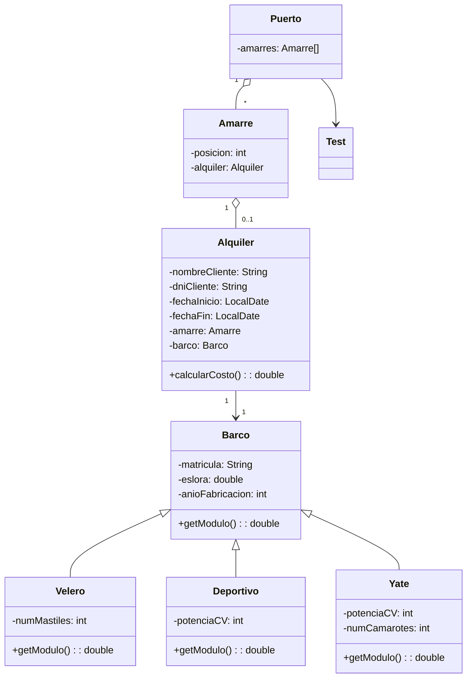

# Diagrama de Clases — Ejercicio 12

```mermaid
classDiagram
    class Puerto {
        -amarres: Amarre[]
    }
    class Amarre {
        -posicion: int
        -alquiler: Alquiler
    }
    class Alquiler {
        -nombreCliente: String
        -dniCliente: String
        -fechaInicio: LocalDate
        -fechaFin: LocalDate
        -amarre: Amarre
        -barco: Barco
        +calcularCosto(): double
    }
    class Barco {
        -matricula: String
        -eslora: double
        -anioFabricacion: int
        +getModulo(): double
    }
    class Velero {
        -numMastiles: int
        +getModulo(): double
    }
    class Deportivo {
        -potenciaCV: int
        +getModulo(): double
    }
    class Yate {
        -potenciaCV: int
        -numCamarotes: int
        +getModulo(): double
    }
    class Test

    Puerto "1" o-- "*" Amarre
    Amarre "1" o-- "0..1" Alquiler
    Alquiler "1" --> "1" Barco
    Barco <|-- Velero
    Barco <|-- Deportivo
    Barco <|-- Yate
    Puerto --> Test
```
