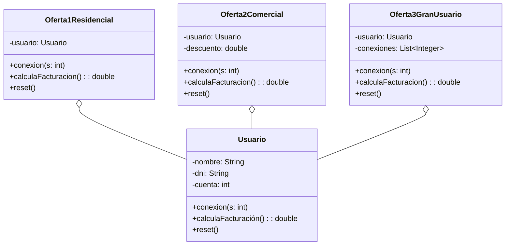

# Diagrama de Clases — Ejercicio 13

```mermaid
classDiagram
    class Usuario {
        -nombre: String
        -dni: String
        -cuenta: int
        +conexion(s: int)
        +calculaFacturación(): double
        +reset()
    }
    class Oferta1Residencial {
        -usuario: Usuario
        +conexion(s: int)
        +calculaFacturacion(): double
        +reset()
    }
    class Oferta2Comercial {
        -usuario: Usuario
        -descuento: double
        +conexion(s: int)
        +calculaFacturacion(): double
        +reset()
    }
    class Oferta3GranUsuario {
        -usuario: Usuario
        -conexiones: List~Integer~
        +conexion(s: int)
        +calculaFacturacion(): double
        +reset()
    }
    Oferta1Residencial o-- Usuario
    Oferta2Comercial o-- Usuario
    Oferta3GranUsuario o-- Usuario
```
