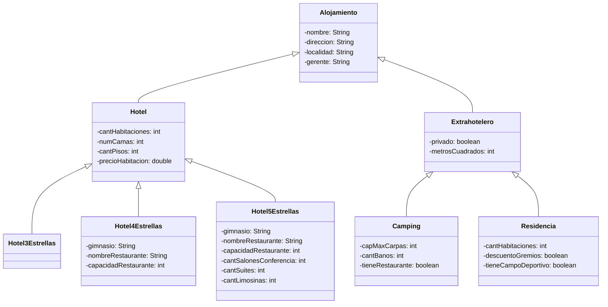

# Diagrama de Clases — Ejercicio 15

```mermaid
classDiagram
    class Alojamiento {
        -nombre: String
        -direccion: String
        -localidad: String
        -gerente: String
    }
    class Hotel {
        -cantHabitaciones: int
        -numCamas: int
        -cantPisos: int
        -precioHabitacion: double
    }
    class Hotel3Estrellas {
    }
    class Hotel4Estrellas {
        -gimnasio: String
        -nombreRestaurante: String
        -capacidadRestaurante: int
    }
    class Hotel5Estrellas {
        -gimnasio: String
        -nombreRestaurante: String
        -capacidadRestaurante: int
        -cantSalonesConferencia: int
        -cantSuites: int
        -cantLimosinas: int
    }
    class Extrahotelero {
        -privado: boolean
        -metrosCuadrados: int
    }
    class Camping {
        -capMaxCarpas: int
        -cantBanos: int
        -tieneRestaurante: boolean
    }
    class Residencia {
        -cantHabitaciones: int
        -descuentoGremios: boolean
        -tieneCampoDeportivo: boolean
    }
    Alojamiento <|-- Hotel
    Hotel <|-- Hotel3Estrellas
    Hotel <|-- Hotel4Estrellas
    Hotel <|-- Hotel5Estrellas
    Alojamiento <|-- Extrahotelero
    Extrahotelero <|-- Camping
    Extrahotelero <|-- Residencia
```
