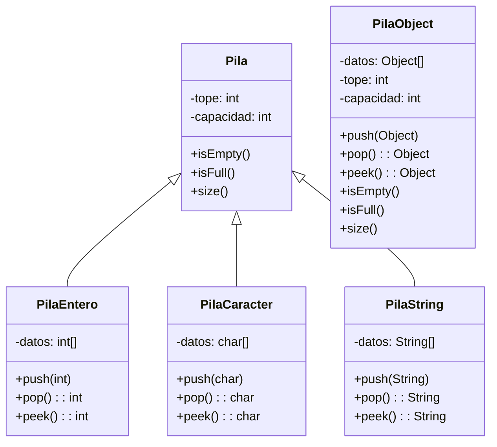

# Diagrama de Clases — Ejercicio 16

```mermaid
classDiagram
    class Pila {
        -tope: int
        -capacidad: int
        +isEmpty()
        +isFull()
        +size()
    }
    class PilaEntero {
        -datos: int[]
        +push(int)
        +pop(): int
        +peek(): int
    }
    class PilaCaracter {
        -datos: char[]
        +push(char)
        +pop(): char
        +peek(): char
    }
    class PilaString {
        -datos: String[]
        +push(String)
        +pop(): String
        +peek(): String
    }
    class PilaObject {
        -datos: Object[]
        -tope: int
        -capacidad: int
        +push(Object)
        +pop(): Object
        +peek(): Object
        +isEmpty()
        +isFull()
        +size()
    }
    Pila <|-- PilaEntero
    Pila <|-- PilaCaracter
    Pila <|-- PilaString
```
