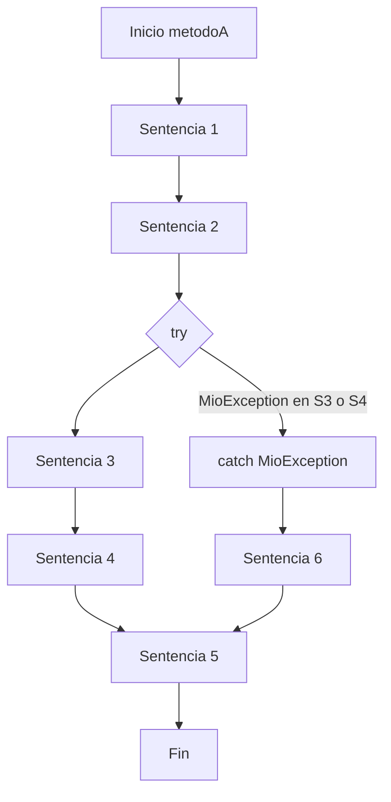

# Diagrama de flujo — Caso MioException

**Orden si ocurre MioException en sentencia_3 o sentencia_4:**
1. sentencia_1
2. sentencia_2
3. sentencia_3 (lanza excepción)
4. catch MioException → sentencia_6
5. sentencia_5
