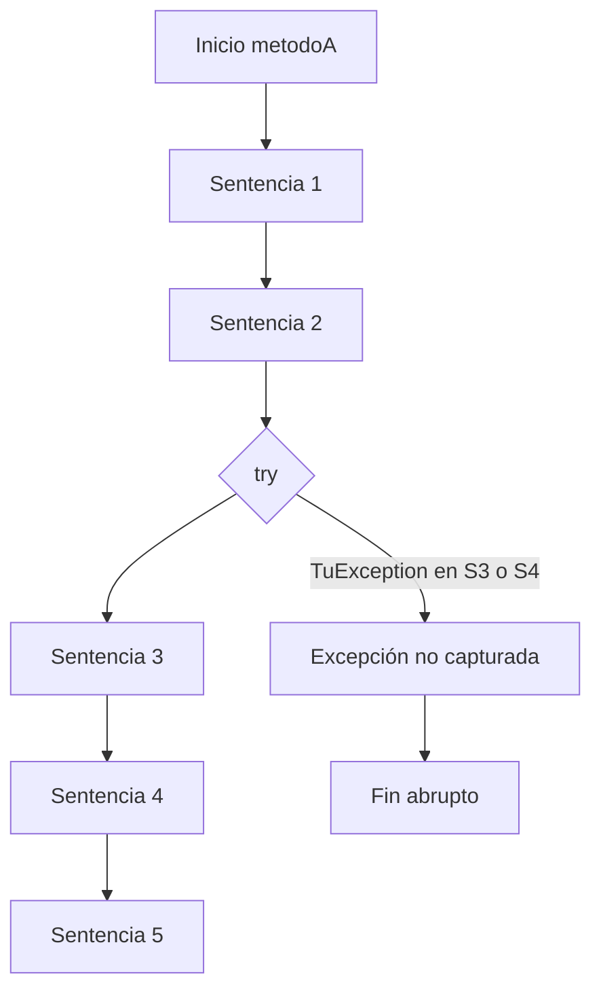

# Diagrama de flujo — Caso TuException

**Orden si ocurre TuException en sentencia_3 o sentencia_4:**
1. sentencia_1
2. sentencia_2
3. sentencia_3 (lanza excepción)
4. método termina abruptamente (no se ejecuta catch ni sentencia_5)
