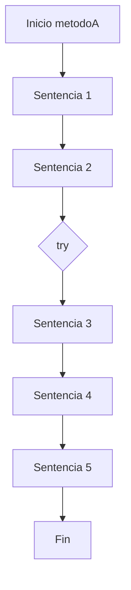

# Diagrama de flujo — Sin excepción

```mermaid
flowchart TD
    A1[Inicio metodoA] --> S1[Sentencia 1]
    S1 --> S2[Sentencia 2]
    S2 --> T1{try}
    T1 --> S3[Sentencia 3]
    S3 --> S4[Sentencia 4]
    S4 --> S5[Sentencia 5]
    S5 --> F[Fin]
```

**Orden si no ocurre ninguna excepción:**
1. sentencia_1
2. sentencia_2
3. sentencia_3
4. sentencia_4
5. sentencia_5
