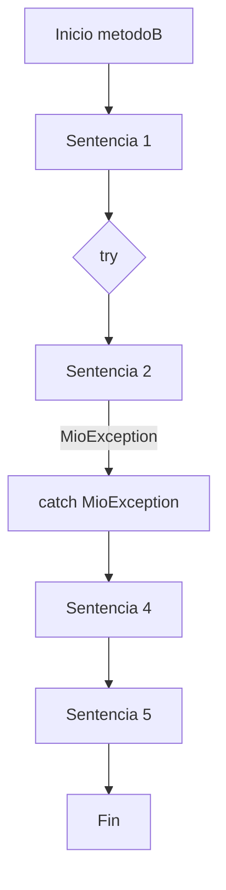

# Diagrama de flujo — MioException en sentencia_2

```mermaid
flowchart TD
    A1[Inicio metodoB] --> S1[Sentencia 1]
    S1 --> T1{try}
    T1 --> S2[Sentencia 2]
    S2 -->|MioException| C1[catch MioException]
    C1 --> S4[Sentencia 4]
    S4 --> S5[Sentencia 5]
    S5 --> F[Fin]
```

**Orden:**
1. sentencia_1
2. sentencia_2 (lanza MioException)
3. catch MioException → sentencia_4
4. sentencia_5
