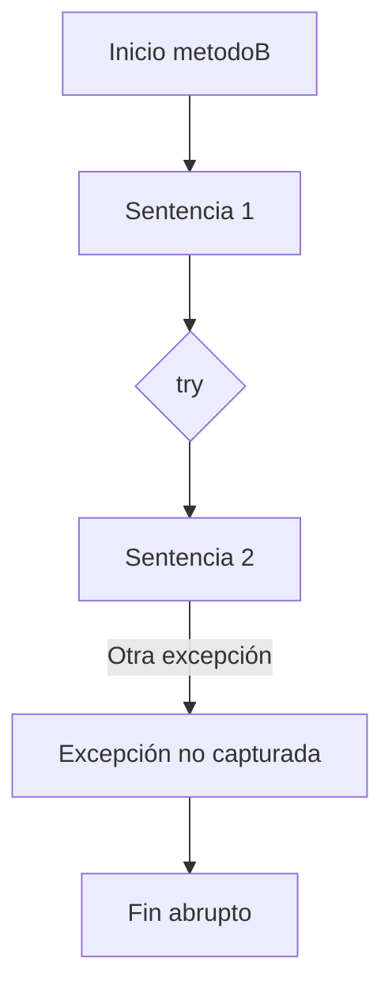

# Diagrama de flujo — Otra excepción en sentencia_2

```mermaid
flowchart TD
    A1[Inicio metodoB] --> S1[Sentencia 1]
    S1 --> T1{try}
    T1 --> S2[Sentencia 2]
    S2 -->|Otra excepción| E1[Excepción no capturada]
    E1 --> F[Fin abrupto]
```

**Orden:**
1. sentencia_1
2. sentencia_2 (lanza otra excepción)
3. método termina abruptamente
