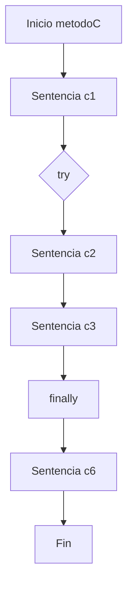

# Diagrama de flujo — Sin excepción (Pregunta b)

```mermaid
flowchart TD
    A1[Inicio metodoC] --> S1[Sentencia c1]
    S1 --> T1{try}
    T1 --> S2[Sentencia c2]
    S2 --> S3[Sentencia c3]
    S3 --> F1[finally]
    F1 --> S6[Sentencia c6]
    S6 --> F[Fin]
```

**Orden:**
1. sentencia_c1
2. sentencia_c2
3. sentencia_c3
4. finally → sentencia_c6
