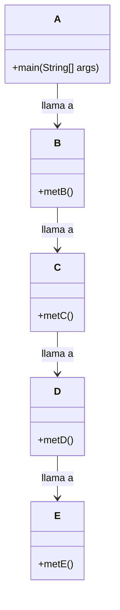

# Diagrama UML — Ejercicio 4

Este diagrama muestra la relación entre las clases y métodos involucrados en la propagación de la excepción desde E.metE() hasta A.main().

Este diagrama representa la cadena de llamadas relevante para el análisis de la propagación de excepciones en este ejercicio.