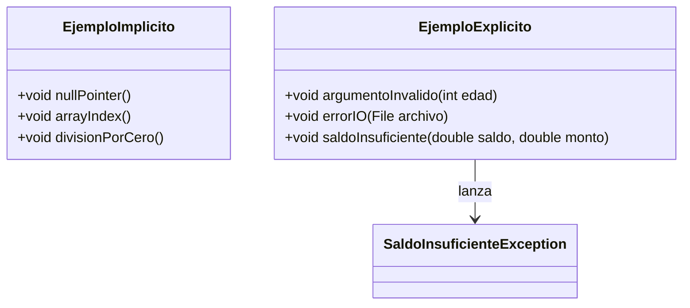

# Diagrama UML — Ejercicio 5

Este diagrama muestra ejemplos de clases y métodos donde pueden ocurrir excepciones implícitas y explícitas.

- Los métodos de `EjemploImplicito` pueden lanzar excepciones implícitas.
- Los métodos de `EjemploExplicito` pueden lanzar excepciones explícitas, incluyendo una excepción personalizada.
