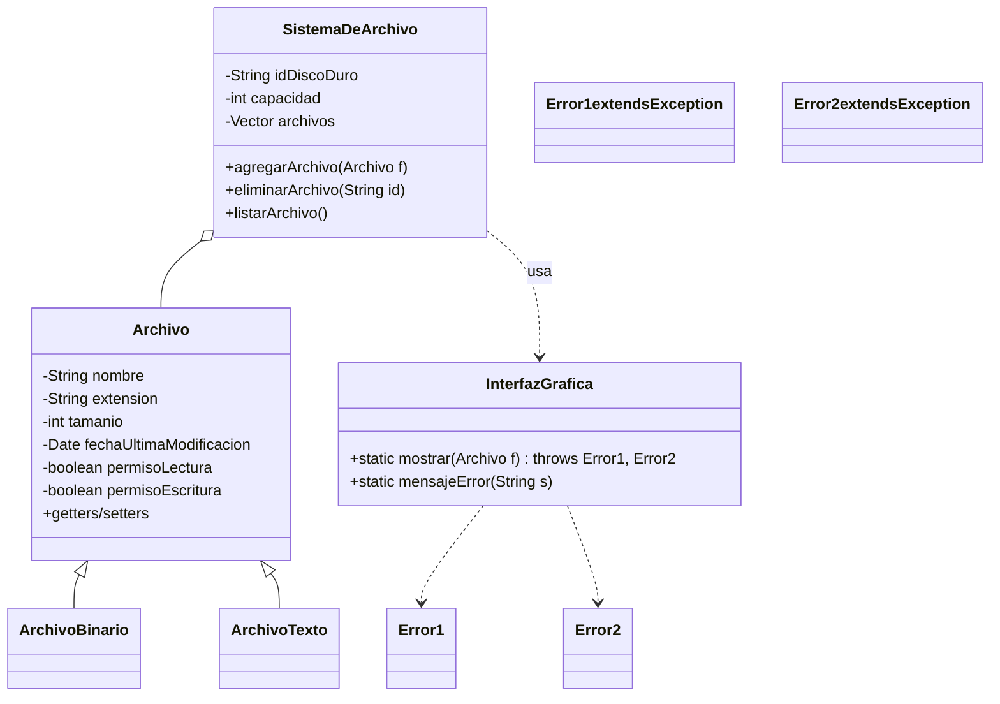

# Diagrama UML — Ejercicio 6

Este diagrama representa la estructura de clases para el sistema de archivos, incluyendo el manejo de errores.

- `Archivo` es la clase base para archivos de cualquier tipo.
- `ArchivoBinario` y `ArchivoTexto` heredan de `Archivo`.
- `SistemaDeArchivo` gestiona una colección de archivos y utiliza `InterfazGrafica` para mostrarlos.
- `Error1` y `Error2` son excepciones personalizadas para el manejo de errores en la interfaz gráfica.
