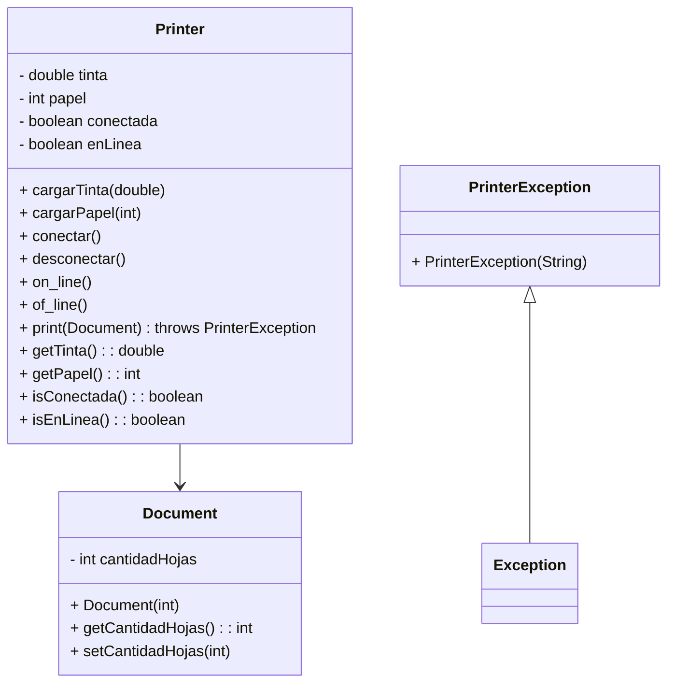

# Diagrama UML - Ejercicio N7

```mermaid
classDiagram
    class Printer {
        - double tinta
        - int papel
        - boolean conectada
        - boolean enLinea
        + cargarTinta(double)
        + cargarPapel(int)
        + conectar()
        + desconectar()
        + on_line()
        + of_line()
        + print(Document) throws PrinterException
        + getTinta(): double
        + getPapel(): int
        + isConectada(): boolean
        + isEnLinea(): boolean
    }
    class Document {
        - int cantidadHojas
        + Document(int)
        + getCantidadHojas(): int
        + setCantidadHojas(int)
    }
    class PrinterException {
        + PrinterException(String)
    }
    Printer --> Document
    PrinterException <|-- Exception
```
