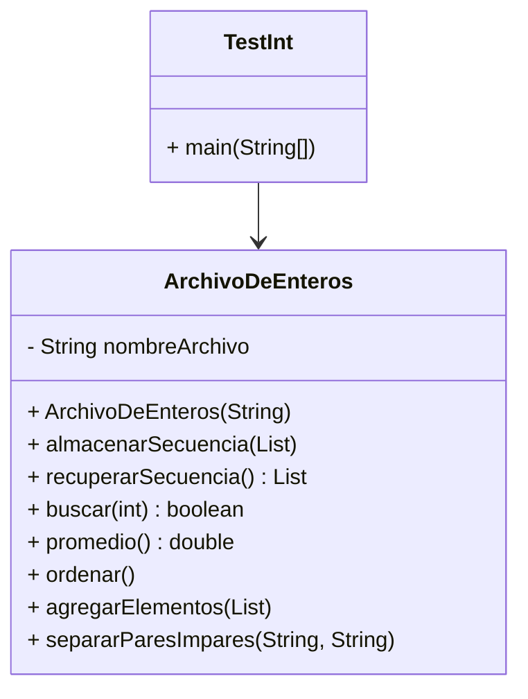

# Conceptos POO aplicados - Ejercicio 1 TP3

## 1. Encapsulamiento
La clase `ArchivoDeEnteros` encapsula la lógica de manejo de archivos binarios de enteros, ocultando los detalles de acceso y manipulación de datos al usuario.

## 2. Abstracción
Se abstrae el concepto de "archivo de números enteros" como un objeto con operaciones de alto nivel: almacenar, recuperar, buscar, ordenar, agregar y separar datos.

## 3. Responsabilidad Única
Cada clase tiene una responsabilidad clara: `ArchivoDeEnteros` gestiona el archivo y sus operaciones, mientras que `TestInt` se encarga de la interacción con el usuario y el menú.

## 4. Manejo de Archivos y Excepciones
Se utiliza la clase `RandomAccessFile` para acceso aleatorio eficiente y se manejan excepciones de entrada/salida (`IOException`) para robustez.

## 5. Colecciones y Algoritmos
Se emplean colecciones (`List<Integer>`) y algoritmos de ordenamiento (`Collections.sort`) para manipular los datos en memoria antes de almacenarlos.

## 6. Modularidad y Reutilización
El diseño permite reutilizar la clase `ArchivoDeEnteros` en otros programas que requieran manipulación de archivos binarios de enteros.

---

## Diagrama de Clases (UML)

---

## Estructura de Clases en la Solución

En este ejercicio se implementaron **tres clases principales**:

- `ArchivoDeEnteros`: Encapsula toda la lógica de manejo de archivos binarios de enteros y las operaciones requeridas.
- `MenuArchivoDeEnteros`: Es responsable de la interacción con el usuario, mostrando el menú y gestionando las opciones elegidas.
- `TestInt`: Contiene únicamente el método `main`, que inicializa los objetos y delega la ejecución del menú.

Esta separación sigue el principio de responsabilidad única y facilita la comprensión, el mantenimiento y la reutilización del código.

---

## Resumen
Este ejercicio integra manejo de archivos binarios, colecciones, modularidad y encapsulamiento, mostrando cómo modelar y resolver un problema realista usando POO en Java.

> **NOTA:** El método `main` y el menú interactivo están implementados en la clase `TestInt`, separada de la clase `ArchivoDeEnteros`. Esto sigue el principio de responsabilidad única y facilita la reutilización del código.