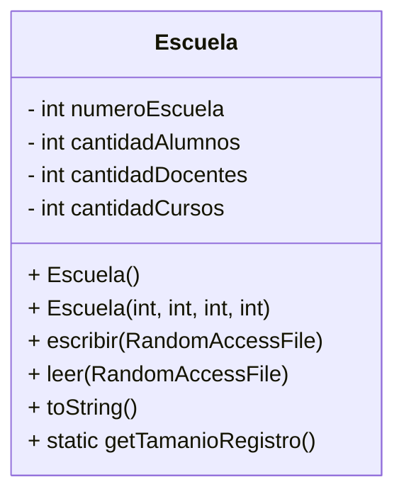

# Conceptos POO aplicados - Ejercicio 2 TP3

Este ejercicio pone en práctica los siguientes conceptos:

- **Encapsulamiento:** La clase `Escuela` agrupa los datos y métodos para manipular un registro de escuela.
- **Abstracción:** Se modela el registro de escuela como un objeto con operaciones de lectura y escritura en archivos binarios.
- **Manejo de archivos binarios:** Uso de `RandomAccessFile` para acceso aleatorio eficiente.
- **Cálculo de offsets:** Se calcula el byte de inicio de cada registro para acceder directamente a cualquier escuela.
- **Alineación y tamaño de registros:** Importancia de mantener registros de tamaño fijo para acceso correcto.

---

## Diagrama de Clase (UML)

Este diagrama muestra la estructura de la clase `Escuela` y sus métodos principales para manipular registros en archivos binarios.