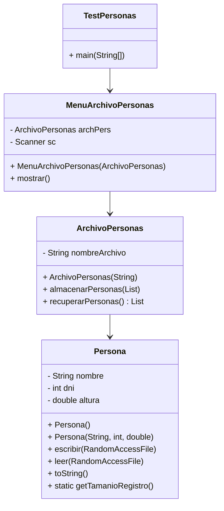

# Conceptos POO aplicados - Ejercicio 3 TP3

## 1. Encapsulamiento
La clase `Persona` encapsula los datos y métodos para manipular un registro de persona. `ArchivoPersonas` gestiona el acceso y almacenamiento de objetos Persona en un archivo binario.

## 2. Abstracción
Se abstrae el concepto de "archivo de personas" como un objeto con operaciones de alto nivel: almacenar y recuperar datos.

## 3. Modularidad y Responsabilidad Única
- `Persona`: representa a una persona con nombre, DNI y altura.
- `ArchivoPersonas`: gestiona el archivo binario y las operaciones sobre personas.
- `MenuArchivoPersonas`: maneja la interacción con el usuario.
- `TestPersonas`: contiene el método main y delega la ejecución al menú.

## 4. Manejo de Archivos Binarios
Se utiliza `RandomAccessFile` para acceso eficiente y directo a los registros.

## 5. Manejo de Strings en Archivos Binarios
El nombre se almacena como un arreglo fijo de bytes para asegurar tamaño constante de registro.

---

## Diagrama de Clases (UML)

---

Este ejercicio integra manejo de archivos binarios, colecciones, modularidad y encapsulamiento, mostrando cómo modelar y resolver un problema realista usando POO en Java.