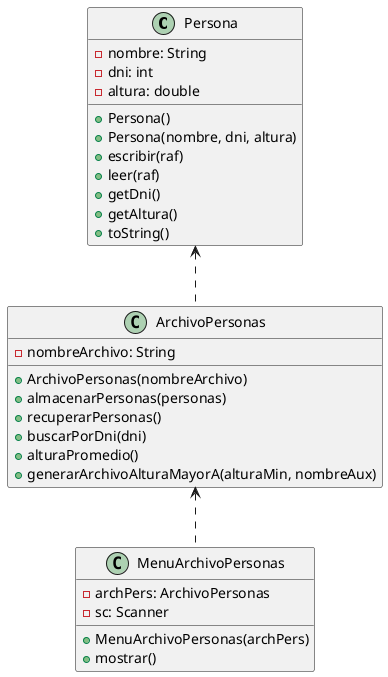

# Diagrama UML (texto)

```plantuml
@startuml
class Persona {
  - nombre: String
  - dni: int
  - altura: double
  + Persona()
  + Persona(nombre, dni, altura)
  + escribir(raf)
  + leer(raf)
  + getDni()
  + getAltura()
  + toString()
}

class ArchivoPersonas {
  - nombreArchivo: String
  + ArchivoPersonas(nombreArchivo)
  + almacenarPersonas(personas)
  + recuperarPersonas()
  + buscarPorDni(dni)
  + alturaPromedio()
  + generarArchivoAlturaMayorA(alturaMin, nombreAux)
}

class MenuArchivoPersonas {
  - archPers: ArchivoPersonas
  - sc: Scanner
  + MenuArchivoPersonas(archPers)
  + mostrar()
}

Persona <.. ArchivoPersonas
ArchivoPersonas <.. MenuArchivoPersonas
@enduml
```

Puedes copiar este diagrama en https://plantuml.com/es/ para visualizarlo gráficamente.
